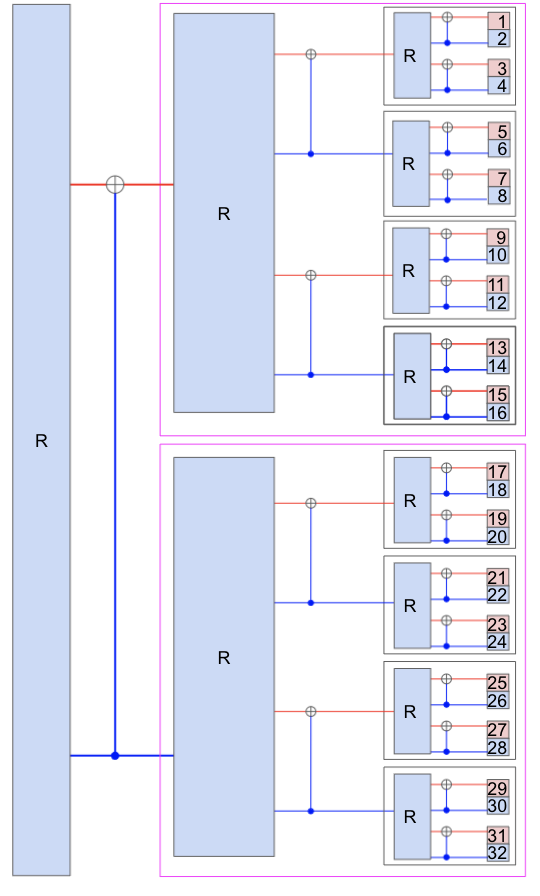
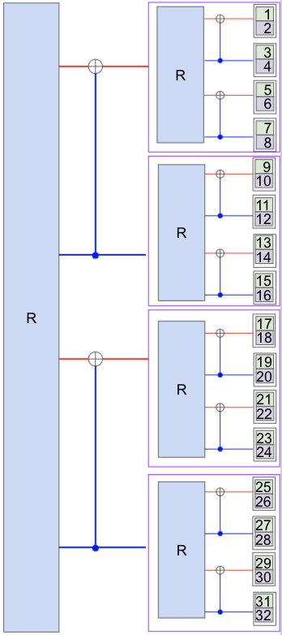

# Polar Coding for Interference Channels

## Introduction

5G communications presents a new paradigm in mobile communications, one that supports higher data rates and an order of magnitude more connected devices. Supporting all of these devices and higher rates requires more base stations that have shorter coverage radii. As a result, these base stations inevitably have more overlap, and have more opportunity for interference with other devices trying to reach the same base station. A naive way to solve this would be to treat this interference as noise and use existing error-correcting schemes, but as the strength of this interference grows when more devices are packed in closer distances, the we can use the information in the interfering messages to achieve better code rates.

Polar coding is a method of error-correcting codes that has been provably shown to reach channel capacity. Currently, the 5G standard only covers polar coding in the case of point-to-point communications for a specific AWGN channel model. This project attempts to use polar codes in an interference channel, as outlined by *[Polar Coding for Interference Networks](https://arxiv.org/pdf/1401.7293.pdf)* by Lele Wang and Eren Şaşoğlu.

The overall scope of the project is a comparison between three interference mitigation methods: Treating Interference as Noise (TIN), Successive Cancellation (SC) and Simultaneous Decoding (SD). The first two can already be implemented in existing point-to-point cases, but Simultaneous Decoding is a novel approach to the problem. 

## Simultaneous Decoding

As explained before, the Simultaneous Decoding improves upon the achievable rate bounds of the other two methods. Consider the case of two transmitters and two receivers. Given a bit channel Pi that originates from channel 1, this bit channel can either be perfectly noisy or perfectly noiseless in the polar coding scheme. However, if the two channel models (transmitter 1 to receiver 1 and transmitter 1 to receiver 2) are different, this means that the bit channels will be polarized in different ways. In this case, bit channel Pi may be perfectly noiseless in one channel and completely noisy in another channel. For the other decoding methods, we would have to consider this given channel as noisy. We call these indices "incompatible". We call these types of indices "type II" and "type III" indices.

However, we can align pairs of these incompatible bit channels such that we reduce the number of bit channels that are noisy in one channel and noiseless in the other. We align these channels recursively using a modulo-2 addition, similar to the regular polar coding scheme. After alignment, we rearrange the indices such that it is in decoding order as to preserve successive decodability. At any given recursion, we double the number of blocks and only half of the of the incompatible indices are aligned, so we decrease the proportion of incompatible indices by half each recursion.

On the decoding side, we also follow a Ui -> VN -> Ui+1N structure, where U and V are two different incoming messages. We first decode a portion of U up to index i and we successively cancel it from V. We then decode all of V and use that to successively cancel it from the rest of U. We finish by decoding the rest of U. This should allow us to achieve rate bounds that match or exceed the bounds that are currently capable in existing point-to-point polar coding schemes. 

Here is a diagram of the polar encoding scheme:
	
| Polar Encoding Scheme (Message U) | Polar Encoding Scheme (Message V) |
| ------------- | ------------- |
|  |   |

From the images, the raw messages come in from the left during encoding. The blue "R" blocks are the rearranging operations done so that decoding order can be successively deocded. The red lines are type II indices and the blue lines are type III indices. The ordered blocks on the right side are the inputs into the polar encoders. We see that at each recursion, we have an aligning step where we align the incompatible indices and a rearranging step. The rearranging of the indices is done as to preserve a successive decoding order. This means that when encoding, this encoding order is reversed from the decoding order. 

More details can be found in the paper previously linked in the introduction.

## Current Progress

The current progress of the project has a few features already implemented, and some yet to be implemented. 

First, two different polar code construction algorithms have been implemented: one using Bhattacharrya parameters and another presented in *[How to Construct Polar Codes](https://arxiv.org/pdf/1105.6164.pdf)* by Ido Tal and Alexander Vardy. The Tal and Vardy aglorithm is based on the implementation by YuYongRun *[Here](https://github.com/YuYongRun/PolarCodes-Encoding-Decoding-Construction)*.

Second, scripts to run simulations for both point-to-point and two-user interference channels.

Third, the typical polar coding encoder and decoder are implemented here as well.

Fourth, the Simultaneous Decoding method has been partially implemented. An encoder has been made, but the decoder is unfinished. Since the decoder is unfinished, the encoder is untested. The current polar decoder may not be capable of being adapted to fit this scheme due to its recursive nature and not being able to save the propagated LLR values. Due to this, a non-recursive version of a polar decoder may work much better and should be better to adapt. This would be the next step. 

## To do
Coming up with a non-recursive polar decoder would be the next step. Only a recursive implementation is provided and it will probably not work with the proposed SD scheme. This scheme would require the decoding order to jump between different code blocks, which couldn't be done with the current implementation. This non-recursive polar decoder should be able to stop decoding when a certain index is reached, but still output the entirety of the polar coding structure with all of its LLR's. This way we can return to it to when the decoding ordere indicates it as so. A scheme where you can decode each bit one by one would be most helpful. This would also require the propagation of the rest of LLR values after each bit is set.

## Implementation details
Here I'll describe some of the relevant (user-facing) functions found in the repository. 

### Code Construction
 - bhattacharrya_bounds.m
	 - Outputs the frozen bits based on the Bhattacharrya parameter. 
 - get_frozen_bits_interference.m
	 - Given a target SNR (dB), interference paramter g and block length N, it outputs the probability of error for each bit index based on the Tal and Vardy algorithm.
 - code_constructions folder
	 - A folder of pre-calculated probability of errors, generated by the Tal and Vardy algorithm. The Tal and Vardy algorithm is generally pretty slow, so this speeds up any simulation that requires the frozen bits.
	 - Files for N = 2048/32768, g (interference constant) = 0.1/0.5/0.9, SNR = 3dB/5dB. 
	 - Ready to use as with readmatrix(file_name).
### Simulation Scripts
- achievable_rate_test.m 
	- Outputs a plot of the achievable rate region for TIN or SC (can be easily changed) based on the bit error rate estimation.
	- Runs a sweep of different code rates and different interference strengths. 
- interference_test.m
	- Outputs a BER vs interference strength plot for different equal code rates. 
	- Can be adapted for TIN or SC.
- point2point_pc.m 
	- Runs a point-to-point simulation for polar codes, plots a BER vs SNR curve. 
### Polar Encoder and Decoder
- pc_encoder.m
	- The polar encoder which takes in the block length N, the original message and the frozen indices
- pc_decoder.m
	- Recursive polar decoder

### Simultaneous Decoding
- get_aligned_structure.m
	- Given the type 2 and type 3 indices, the block length, the number of blocks and the number of recursions, this function returns the decoding reordering, the encoding ordering and the incompatible indices at each recursion.
	- Each row of the outputs is the rearranging block at that given recursion, or it is the incompatible indices at the given recursion.
- get_full_decoding_order.m
	- Given the decoding orders and the incompatible indices at each recursion, this function returns the complete decoding order after all of the recursions, as well as the aligned indices after rearranging. 
	- Will be used in the decoding to determine which indices are combined with each other.
- full_dec_order.m
	- A test for the other functions that shows the decoding order and the combined indices.
- align_incompatible.m
	- The encoder for the SD algorithm, given the message u, incompatible indices at each recursion, the encoding orders at each recursion, the block size and the number of recursions, it outputs the aligned message u that can then be put through the polar encoder.
